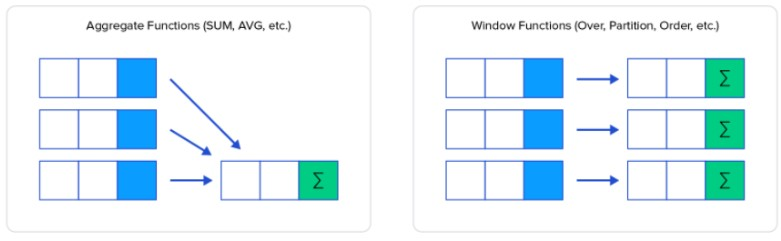
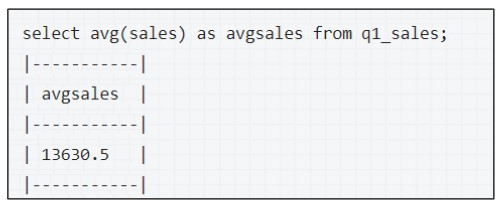
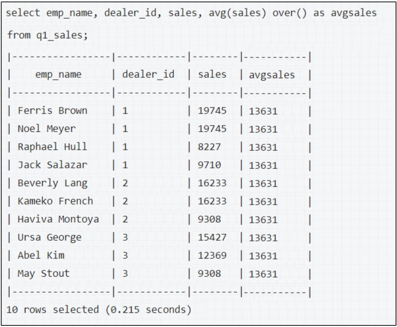
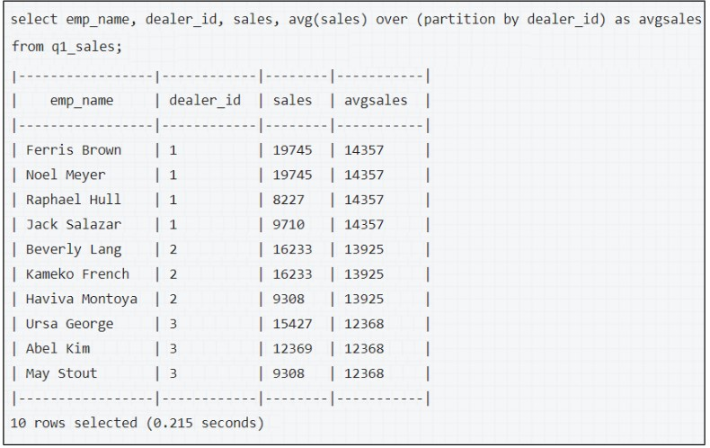
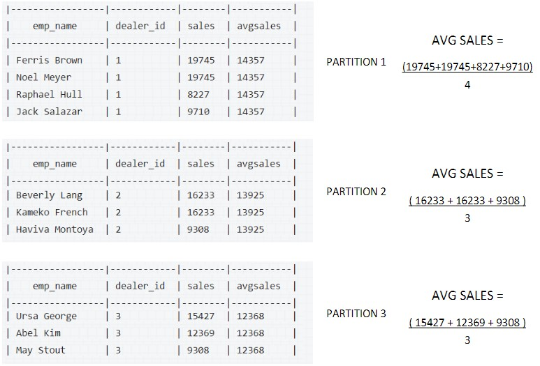
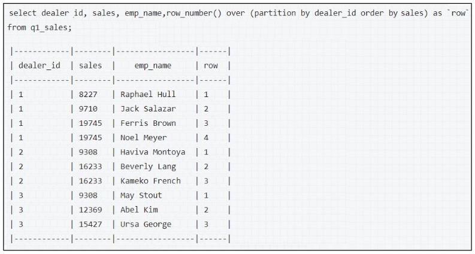

FIXME

## WINDOW FUNCTIONS

The window function is similar to an aggregate function, but it splits (partitions) the data into multiple groups based on the query and then performs an aggregation (or) function on these segments and returns a value for each row in the table.



The window function is used mostly in the select statement, partitions the data and perform some function across each partition. Some common window functions are:
•OVER
•ROW_NUMBER()
•RANK()
•DENSE_RANK()

#### Syntax
```sql
SELECT column(s), FUNCTION(column) OVER(PARTITION BY column ORDER BY column) FROM table_name
```

For example, consider a table q1 sales which has quarter1 sales details of a company. To find the average sales of the entire quarter:



## OVER

The over function helps to print the  result  of the  aggregate function  for each  record in the final output. Thus, the final output is not just one row which gives the aggregation result, but rather the entire table selected along with a new column where the aggregation result is printed once for each row.



Thus, the overall average of the sales column has been calculated and the result is presented in a new column called “avgsales”. All the records in this column comprise of the same value which is the average sales seen in the previous query.

## PARTITIONBY

The PARTITIONBY function is used to split the data into multiple partitions and then perform the aggregation function on each of these partitions.



In the above example, the dataset is partitioned based on dealer_id.



## ORDER BY

The ORDER BY clause helps to order the results in ascending or descending order inside each partition.




